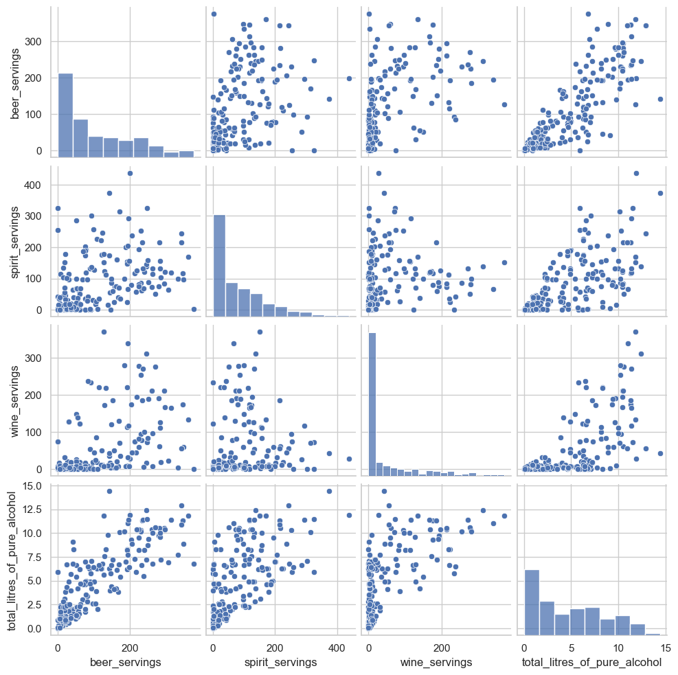
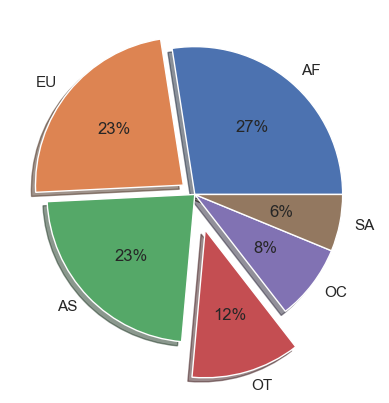
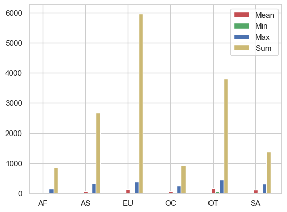
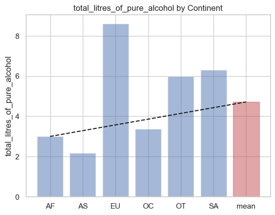
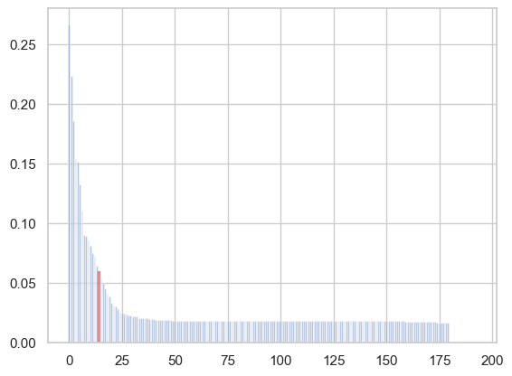

```python
# Magic commands
%config Completer.use_jedi = False
%whos
import pdb ###  pdb.set_trace()
```

    Interactive namespace is empty.
    


```python
import pandas as pd
import numpy as np
import matplotlib.pylab as plt

# csv 읽어들이기

file_path = '../data/drinks.csv'
drinks = pd.read_csv(file_path)

#print(drinks.info())
#drinks.head()
drinks.describe()
```


<div>
<style scoped>
    .dataframe tbody tr th:only-of-type {
        vertical-align: middle;
    }

    .dataframe tbody tr th {
        vertical-align: top;
    }

    .dataframe thead th {
        text-align: right;
    }
</style>
<table border="1" class="dataframe">
  <thead>
    <tr style="text-align: right;">
      <th></th>
      <th>beer_servings</th>
      <th>spirit_servings</th>
      <th>wine_servings</th>
      <th>total_litres_of_pure_alcohol</th>
    </tr>
  </thead>
  <tbody>
    <tr>
      <th>count</th>
      <td>193.000000</td>
      <td>193.000000</td>
      <td>193.000000</td>
      <td>193.000000</td>
    </tr>
    <tr>
      <th>mean</th>
      <td>106.160622</td>
      <td>80.994819</td>
      <td>49.450777</td>
      <td>4.717098</td>
    </tr>
    <tr>
      <th>std</th>
      <td>101.143103</td>
      <td>88.284312</td>
      <td>79.697598</td>
      <td>3.773298</td>
    </tr>
    <tr>
      <th>min</th>
      <td>0.000000</td>
      <td>0.000000</td>
      <td>0.000000</td>
      <td>0.000000</td>
    </tr>
    <tr>
      <th>25%</th>
      <td>20.000000</td>
      <td>4.000000</td>
      <td>1.000000</td>
      <td>1.300000</td>
    </tr>
    <tr>
      <th>50%</th>
      <td>76.000000</td>
      <td>56.000000</td>
      <td>8.000000</td>
      <td>4.200000</td>
    </tr>
    <tr>
      <th>75%</th>
      <td>188.000000</td>
      <td>128.000000</td>
      <td>59.000000</td>
      <td>7.200000</td>
    </tr>
    <tr>
      <th>max</th>
      <td>376.000000</td>
      <td>438.000000</td>
      <td>370.000000</td>
      <td>14.400000</td>
    </tr>
  </tbody>
</table>
</div>


```python
## 상관관계 분석
## pearson 상관관계 
corr = drinks[['beer_servings', 'wine_servings']].corr(method = 'pearson')
#print(corr)


## 피처간의 상관계수 행렬 구하기
cols = ['beer_servings', 'spirit_servings', 'wine_servings', 'total_litres_of_pure_alcohol']
corr = drinks[cols].corr(method = 'pearson')
print(corr)
```

                                  beer_servings  spirit_servings  wine_servings  \
    beer_servings                      1.000000         0.458819       0.527172   
    spirit_servings                    0.458819         1.000000       0.194797   
    wine_servings                      0.527172         0.194797       1.000000   
    total_litres_of_pure_alcohol       0.835839         0.654968       0.667598   
    
                                  total_litres_of_pure_alcohol  
    beer_servings                                     0.835839  
    spirit_servings                                   0.654968  
    wine_servings                                     0.667598  
    total_litres_of_pure_alcohol                      1.000000  
    


```python
# 히트맵 예제 4X4
import seaborn as sns
import matplotlib.pyplot as plt

#corr 행렬 히트맵을 시각화합니다.
cols_view = ['beer', 'spirit', 'wine', 'alcohol']
sns.set(font_scale=1.5)
hm = sns.heatmap(corr.values,
                cbar = True,
                annot = True,
                square = True,
                fmt = '.2f',
                annot_kws = {'size': 15},
                 yticklabels = cols_view,
                 xticklabels = cols_view)

plt.tight_layout()
plt.show()
```


    

    


```python
# 산점도 그래프 출력
sns.set(style = 'whitegrid', context='notebook')
sns.pairplot(drinks[['beer_servings','spirit_servings', 'wine_servings' ,'total_litres_of_pure_alcohol']], height = 2.5)

plt.show()
```

    C:\lang\anaconda3\Lib\site-packages\seaborn\axisgrid.py:118: UserWarning: The figure layout has changed to tight
      self._figure.tight_layout(*args, **kwargs)
    


    

    


```python
# 결측 데이터 전처리 하기  NaN   -->    OT

#결측 데이터를 처리 
drinks['continent'] = drinks['continent'].fillna('OT')
drinks.head(10)
```


<div>
<style scoped>
    .dataframe tbody tr th:only-of-type {
        vertical-align: middle;
    }

    .dataframe tbody tr th {
        vertical-align: top;
    }

    .dataframe thead th {
        text-align: right;
    }
</style>
<table border="1" class="dataframe">
  <thead>
    <tr style="text-align: right;">
      <th></th>
      <th>country</th>
      <th>beer_servings</th>
      <th>spirit_servings</th>
      <th>wine_servings</th>
      <th>total_litres_of_pure_alcohol</th>
      <th>continent</th>
    </tr>
  </thead>
  <tbody>
    <tr>
      <th>0</th>
      <td>Afghanistan</td>
      <td>0</td>
      <td>0</td>
      <td>0</td>
      <td>0.0</td>
      <td>AS</td>
    </tr>
    <tr>
      <th>1</th>
      <td>Albania</td>
      <td>89</td>
      <td>132</td>
      <td>54</td>
      <td>4.9</td>
      <td>EU</td>
    </tr>
    <tr>
      <th>2</th>
      <td>Algeria</td>
      <td>25</td>
      <td>0</td>
      <td>14</td>
      <td>0.7</td>
      <td>AF</td>
    </tr>
    <tr>
      <th>3</th>
      <td>Andorra</td>
      <td>245</td>
      <td>138</td>
      <td>312</td>
      <td>12.4</td>
      <td>EU</td>
    </tr>
    <tr>
      <th>4</th>
      <td>Angola</td>
      <td>217</td>
      <td>57</td>
      <td>45</td>
      <td>5.9</td>
      <td>AF</td>
    </tr>
    <tr>
      <th>5</th>
      <td>Antigua &amp; Barbuda</td>
      <td>102</td>
      <td>128</td>
      <td>45</td>
      <td>4.9</td>
      <td>OT</td>
    </tr>
    <tr>
      <th>6</th>
      <td>Argentina</td>
      <td>193</td>
      <td>25</td>
      <td>221</td>
      <td>8.3</td>
      <td>SA</td>
    </tr>
    <tr>
      <th>7</th>
      <td>Armenia</td>
      <td>21</td>
      <td>179</td>
      <td>11</td>
      <td>3.8</td>
      <td>EU</td>
    </tr>
    <tr>
      <th>8</th>
      <td>Australia</td>
      <td>261</td>
      <td>72</td>
      <td>212</td>
      <td>10.4</td>
      <td>OC</td>
    </tr>
    <tr>
      <th>9</th>
      <td>Austria</td>
      <td>279</td>
      <td>75</td>
      <td>191</td>
      <td>9.7</td>
      <td>EU</td>
    </tr>
  </tbody>
</table>
</div>


```python
# 파이차트로 시각화 하기
labels = drinks['continent'].value_counts().index.tolist()
fracs1 = drinks['continent'].value_counts().values.tolist()

explode = (0,0.1,0,0.25,0,0)

plt.pie(fracs1, explode=explode, labels=labels, autopct='%.0f%%', shadow=True)
plt.show()
```


    

    


```python
# 각각의 agg 함수로 분석하기
# 품목별 mean min max sum 으로 계산

# 대륙별 spirit_servings의 평균, 최소, 최대, 합계를 계산한다.
result = drinks.groupby('continent').spirit_servings.agg(['mean','min','max','sum'])
result.head()
```


<div>
<style scoped>
    .dataframe tbody tr th:only-of-type {
        vertical-align: middle;
    }

    .dataframe tbody tr th {
        vertical-align: top;
    }

    .dataframe thead th {
        text-align: right;
    }
</style>
<table border="1" class="dataframe">
  <thead>
    <tr style="text-align: right;">
      <th></th>
      <th>mean</th>
      <th>min</th>
      <th>max</th>
      <th>sum</th>
    </tr>
    <tr>
      <th>continent</th>
      <th></th>
      <th></th>
      <th></th>
      <th></th>
    </tr>
  </thead>
  <tbody>
    <tr>
      <th>AF</th>
      <td>16.339623</td>
      <td>0</td>
      <td>152</td>
      <td>866</td>
    </tr>
    <tr>
      <th>AS</th>
      <td>60.840909</td>
      <td>0</td>
      <td>326</td>
      <td>2677</td>
    </tr>
    <tr>
      <th>EU</th>
      <td>132.555556</td>
      <td>0</td>
      <td>373</td>
      <td>5965</td>
    </tr>
    <tr>
      <th>OC</th>
      <td>58.437500</td>
      <td>0</td>
      <td>254</td>
      <td>935</td>
    </tr>
    <tr>
      <th>OT</th>
      <td>165.739130</td>
      <td>68</td>
      <td>438</td>
      <td>3812</td>
    </tr>
  </tbody>
</table>
</div>


```python
# 전체 평균보다 많은 알코올을 섭취하는 대륙
# 1.1 전체 대륙 평균
total_mean = drinks.total_litres_of_pure_alcohol.mean()

# 1.2 대륙별 평균
continent_mean = drinks.groupby('continent')['total_litres_of_pure_alcohol'].mean()

# 1.3 전체 대륙 평균 이상
over_total_mean = continent_mean[continent_mean >= total_mean]
print (over_total_mean)


```

    continent
    EU    8.617778
    OT    5.995652
    SA    6.308333
    Name: total_litres_of_pure_alcohol, dtype: float64
    


```python
# 평균 bear_serving가 가장 높은 대륙은? idxmax

bear_servings_means = drinks.groupby('continent')['beer_servings'].mean().idxmax()
bear_servings_means
```


    'EU'


```python
# 대륙별 spirit_servings 평균, 최소, 최대 합계를 시각화
# 상기에서 result를 이용
result.info()

# X축 개수 구하기
n_groups = len(result)


means = result['mean']
mins = result['min']
maxs = result['max']
sums = result['sum']

# 개수로 배열 만들기 
index = np.arange(n_groups)

# 대륙별 값의 개수와 그 리스트를 반환
labels = drinks['continent'].value_counts().index.tolist()

bar_width = 0.1

# 각각의 막대 그래프 그리기
rects1 = plt.bar(index, means, bar_width, color='r', label='Mean')
rects2 = plt.bar(index+bar_width, mins, bar_width, color='g', label='Min')
rects3 = plt.bar(index+bar_width*2, maxs, bar_width, color='b', label='Max')
rects4 = plt.bar(index+bar_width*3, sums, bar_width, color='y', label='Sum')

# result의 인덱스를 추출하여 x축에 입력
plt.xticks(index, result.index.tolist())
plt.legend()
plt.show()
```

    <class 'pandas.core.frame.DataFrame'>
    Index: 6 entries, AF to SA
    Data columns (total 4 columns):
     #   Column  Non-Null Count  Dtype  
    ---  ------  --------------  -----  
     0   mean    6 non-null      float64
     1   min     6 non-null      int64  
     2   max     6 non-null      int64  
     3   sum     6 non-null      int64  
    dtypes: float64(1), int64(3)
    memory usage: 240.0+ bytes
    


    

    


```python
# 대륙별 total_litres_of_pure_alcohol을 시각화
# 막대 그래프에서 평균선 그리기
# 그래프를 그릴땐 list형태로 한다.
# continent_mean이 주 변수   --> continent_mean = drinks.groupby('continent')['total_litres_of_pure_alcohol'].mean()
continents = continent_mean.index.tolist()
continents.append('mean')
alcohol = continent_mean.values.tolist()
alcohol.append(total_mean)

bar_list = plt.bar(x_pos, alcohol, align='center', alpha =0.5)

bar_list[continents.index('mean')].set_color('r') # mean은 붉은색
plt.plot([0,6], [3, total_mean], "--k")  # (0,3)에서 (6,total_mean) 까지 --을 블랙(k)으로 그린다.
x_pos = np.arange(len(continents))
plt.xticks(x_pos, continents)


plt.ylabel('total_litres_of_pure_alcohol')
plt.title('total_litres_of_pure_alcohol by Continent')
plt.show()
```


    

    


```python
# 대륙별 beer_servings를 시작화
# 평균값을 맨 뒤에 추가한다.
# 대륙별 beer_servings의 합계를 구하서 그래프로 출력

beer_group = drinks.groupby('continent')['beer_servings'].sum()
continents = beer_group.index.tolist()

ypos = np.arange(len(continents))
alcohol = beer_group.tolist()

# labels = beer_group.index.tolist()
bar_list = plt.bar(ypos, alcohol, align='center', alpha=0.5)
bar_list[continents.index('EU')].set_color('r')


plt.xticks(ypos, continents)
plt.ylabel('beer_servings')
plt.title('beer_servings by Continent')

plt.show()

# plt.bar(labels, alcohol, bar_width, color='b', label='Sum')
```


    

    


```python
### 술을 독하게 마신다? 즉, 알콜량 / 전체소비량 으로 독한정도를 파악한다.

drinks['alcohol_rate'] = drinks['total_litres_of_pure_alcohol'] / (drinks['beer_servings'] + drinks['spirit_servings'] + drinks['wine_servings'])

drinks.isnull().sum()  ## null값이 있는지 확인한다.

drinks['alcohol_rate'] = drinks['alcohol_rate'].fillna(0)  ## null값을 0으로 채워 다시 df에 넣는다,

##  필요한 정보만 빼내어 소팅한다.
coutry_with_rank = drinks[['country', 'alcohol_rate']]  # 나라와 알콜도수를 추출

coutry_with_rank = coutry_with_rank.sort_values('alcohol_rate', ascending=0)  ## 내림차순 정령

## 그래프 그리기

x_pos = np.arange(len(coutry_with_rank['country']))
countrys = coutry_with_rank['country'].tolist()
rate_list = coutry_with_rank['alcohol_rate'].tolist()

bar_list = plt.bar(x_pos, rate_list, align='center', alpha =0.5)
bar_list[countrys.index('South Korea')].set_color('r')

plt.show()


```


    

    

