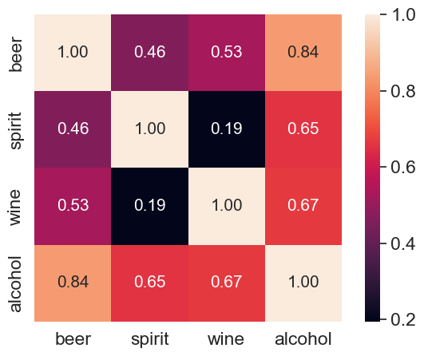
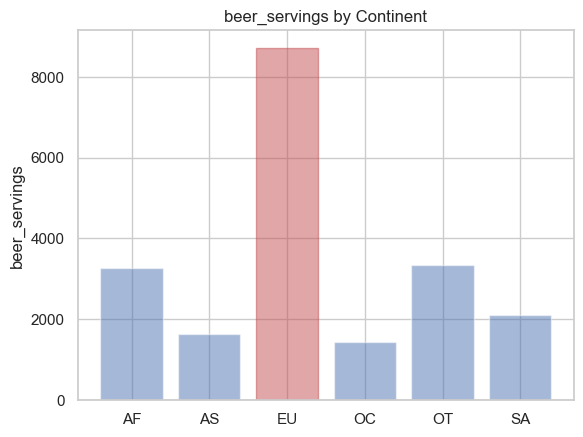

# Python 활용한 데이터 전처리/시각화
# Chapter 2. 데이터 시각화
 
데이터 시각화는 데이터 분석과정에서 매우 중요한 부분입니다.     
프로젝트 초기 단계 또는 리포팅 단계에서의 탐색적 데이터 분석(EDA)의 일환으로 결과를 다른 사람과 공유할 때 유용합니다.    
또한 데이터를 시각화 하면 값의 분포나 값 사이의 관계를 확인하고 모델링을 위한 가설 도출을 하는데 도움이 됩니다.    

<br><br>

## 1. Matplotlib 라이브러리

### <b>Matplotlib 개요
Matplotlib는 파이썬에서 데이터를 차트나 플롯(Plot)으로 그려주는 가장 많이 사용되는 데이터 시각화(Data Visualization) 패키지로 라인 plot, 바 차트, 파이차트, 히스토그램, Box Plot, Scatter Plot 등을 비롯하여 다양한 차트와 plot 스타일을 지원합니다.    
웹페이지(https://matplotlib.org/index.html) 에서 다양한 샘플 차트를 볼 수 있습니다.


```python
%matplotlib inline
import matplotlib.pyplot as plt
```

### <b>Matplotlib 사용법
Matplotlib를 사용하여 시각화를 하기 위해서는 아래 3가지 코드를 기억해야 합니다.

- plt.figure() - 시각화 그림을 표시할 영역 지정
- plt.plot() - 시각화 차트 및 값 지정
- plt.show() - 시각화 명령어


```python
#Matplotlib를 사용하여 간단한 차트를 그리기
plt.figure()
plt.plot([1,2,3],[100,200,300])
plt.show()

```


    

    


차트 크기 키우기    
차트의 크기는 그림을 표시할 영역의 크기를 키움으로 해결 할 수 있습니다.    
figsize 옵션을 사용해서 조정 합니다. ( 기본 값은 (6,4) )


```python
plt.figure(figsize=(16,5))
plt.plot([1,2,3], [100,120,110])
plt.show()
```


    

    


<br><br>
## 2. Matplotlib 목적별 차트 그리기
### <b> 선그래프(line plot) 그리기
선 그래프는 수치의 변화를 선으로 이어서 그려 줍니다.    
이 때문에 보통 선그래프는 시간에 따른 데이터의 변화 추세를 볼 때 사용합니다.


```python
#주간 일별 최고기온 리포트를 그리기
plt.figure()
plt.plot(["Mon","Tue","Wed","Thu","Fri","Sat","Sun"], [28,30,29,31,32,31,31] )
plt.show()
```


    

    


Pandas에서 선그래프 그리기


```python
#cust_data.csv 파일을 DataFrame으로 불러오기
import pandas as pd
df=pd.read_csv("cust_data.csv")
df.head()
```


<div>
<style scoped>
    .dataframe tbody tr th:only-of-type {
        vertical-align: middle;
    }

    .dataframe tbody tr th {
        vertical-align: top;
    }

    .dataframe thead th {
        text-align: right;
    }
</style>
<table border="1" class="dataframe">
  <thead>
    <tr style="text-align: right;">
      <th></th>
      <th>class</th>
      <th>sex</th>
      <th>age</th>
      <th>service</th>
      <th>stop</th>
      <th>npay</th>
      <th>avg_bill</th>
      <th>A_bill</th>
      <th>B_bill</th>
      <th>termination</th>
      <th>by_age</th>
      <th>bill_rating</th>
    </tr>
  </thead>
  <tbody>
    <tr>
      <th>0</th>
      <td>C</td>
      <td>F</td>
      <td>28</td>
      <td>0</td>
      <td>N</td>
      <td>N</td>
      <td>2640.0000</td>
      <td>792.00000</td>
      <td>1584.0000</td>
      <td>Y</td>
      <td>20</td>
      <td>low</td>
    </tr>
    <tr>
      <th>1</th>
      <td>E</td>
      <td>F</td>
      <td>24</td>
      <td>1</td>
      <td>N</td>
      <td>N</td>
      <td>16840.0000</td>
      <td>2526.00000</td>
      <td>6983.0000</td>
      <td>N</td>
      <td>20</td>
      <td>high</td>
    </tr>
    <tr>
      <th>2</th>
      <td>F</td>
      <td>F</td>
      <td>32</td>
      <td>1</td>
      <td>N</td>
      <td>N</td>
      <td>15544.7334</td>
      <td>2331.71001</td>
      <td>6750.4666</td>
      <td>N</td>
      <td>30</td>
      <td>high</td>
    </tr>
    <tr>
      <th>3</th>
      <td>D</td>
      <td>M</td>
      <td>18</td>
      <td>1</td>
      <td>N</td>
      <td>N</td>
      <td>4700.0000</td>
      <td>0.00000</td>
      <td>4502.0000</td>
      <td>N</td>
      <td>10</td>
      <td>low</td>
    </tr>
    <tr>
      <th>4</th>
      <td>C</td>
      <td>F</td>
      <td>78</td>
      <td>1</td>
      <td>N</td>
      <td>N</td>
      <td>1361.7999</td>
      <td>1173.99990</td>
      <td>0.0000</td>
      <td>N</td>
      <td>70</td>
      <td>low</td>
    </tr>
  </tbody>
</table>
</div>


```python
#불러온 데이터를 사용하여 선그래프를 그리기
df.plot()
# plt.figure(figsize=(50,30))
plt.show()
```


    

    


하나의 열에 대해서만 시각화 하기


```python
#avg_bill만으로 그래프 그리기
df['avg_bill'].plot(figsize=(50,30))
plt.show()
```


    

    


### <b>산점도 그리기
산점도는 키와 몸무게 같은 두 값 간의 관계를 표현 합니다.    
두 값이 양의 상관관계인지 음의 상관관계인지를 파악할 수 있습니다.    
산점도 위에 회귀선을 하나 그리면 하나의 값에 따라 다른 값이 어떻게 변하는지를 예측 할 수도 있습니다.    
plt.scatter()를 사용하고 X와 Y값을 지정해야 합니다.


```python
#avg_bill, age간의 관꼐를 알아보기 위해 산점도 그리기
plt.figure(figsize=(16,6))
plt.scatter(y=df["avg_bill"], x=df["age"])
plt.show()
```


    

    


### <b>히스토그램 그리기
히스토그램은 수치형 데이터의 분포를 나타 냅니다.    
흔히 빈도, 빈도밀도, 확율 등의 분포를 그릴때 사용합니다.    
plt.hist()를 사용하며, 구간값(bins)을 정해주지 않으면 10개 구간으로 나누어 그래프를 그려 줍니다.


```python
#A_bill에 대한 빈도를 10개 구간으로 그리기
plt.figure()
plt.hist(df["A_bill"])
plt.show()
```


    

    


```python
#age에 대한 빈도를 20개 구간으로 그리기
plt.figure()
# plt.hist(df["age"],bins=100)
plt.hist(df["age"],bins=20)
plt.show()
```


    

    


### <b> 박스 그래프 그리기
수치적 자료를 표현하는 그래프입니다.   
수치적 자료로부터 얻어낸 통계량인 5가지 요약 수치(최소값, 제 1사분위값, 제 2사분위값, 제 3사분위값, 최대값)를 가지고 그리프를 만듭니다.   
plt.boxplot() 명령어를 사용합니다


```python
#임의의 값 리스트를 생성하고, 생성한 리스트를 사용하여 박스 그래프 그리기
x=[5, 3, 7, 10, 9, 5, 3.5, 8]

plt.boxplot(x=x)
plt.show()
```


    

    


Pandas에서 가로 box plot 그리기    
by는 Group화 할 값(컬럼), column은 박스 그래프로 나타낼 값(컬럼)을 넣어주면 됩니다.


```python
#나이대별 총이용금액 분포를 박스 그래프로 그리기
df.boxplot(by="by_age", column="avg_bill", figsize=(16,8))
plt.show()
```


    

    


### <b> 막대 그래프(barplot)
막대 그래프는 범주형 데이터의 수치를 요약해서 보여주니다.     
일반적으로 가로,세로,누적,그룹화 된 막대 그래프 등을 사용하며, plt.plot()대신 plt.bar() 명령어를 사용 할수있습니다.


```python
#임의의 값 리스트를 생성하고, 생성한 리스트를 사용하여 막대 그래프 그리기
y=[5, 3, 7, 10, 9, 5, 3.5, 8]
x=list(range(len(y)))

plt.figure()
plt.bar(x, y)
plt.show()
```


    

    


pandas내 pivot_table 함수를 사용하면 쉽게 수치들에 대한 mean/sum/max등을 구할 수 있습니다.


```python
#service수 별 평균 요금과 나이에 대한 테이블을 만들기
df2=pd.pivot_table(df, index = ['service'])
print(df2)
```

                  A_bill        B_bill        age      avg_bill     by_age
    service                                                               
    0        1981.528149   3879.951630  46.666165   7236.455570  41.954887
    1        1483.139097   5360.871950  46.791262   9345.489818  42.295423
    2        1746.659325   6655.078705  51.586727  12067.188611  46.990950
    3        2111.894434   7619.353756  52.977918  14478.304938  48.580442
    4        2598.924160   8395.592281  51.231579  16941.010748  46.842105
    5        3443.451696   8775.659557  52.212121  17737.738866  47.575758
    6        3331.534814   8063.901353  52.916667  18995.406545  48.333333
    7        4372.028915   6674.286400  48.800000  20929.849057  44.000000
    8        1699.500000   8058.963100  40.000000  11544.646115  35.000000
    9        1878.583350  12348.789850  55.500000  20850.559980  55.000000
    10       5238.598125      0.000000  58.000000  13247.153480  50.000000
    11       5238.598125      0.000000  51.000000  18356.466600  50.000000
    14       5238.598125      0.000000  63.000000  21668.386520  60.000000


Pandas에서 막대그래프 그리기


```python
#service수 별 A,B 서비스 요금에 대한 막대 그래프 그리기
df2[['A_bill', 'B_bill']].plot(kind='bar')
# df[['A_bill', 'B_bill']].plot(kind='bar')
```


    <AxesSubplot:xlabel='service'>


    

    


누적 막대그래프 만들기    
누적 막대 그래프는 막대 그래프 함수를 사용하고 stacked 옵션을 True로 변경하면 됩니


```python
#service수 별 A,B 서비스 요금에 대한 요금 누적 그래프 그리기
df2[['A_bill', 'B_bill']].plot(kind='bar', stacked=True)
```


    <AxesSubplot:xlabel='service'>


    

    


<br><br>
## 3. 차트 꾸미기
### <b>제목과 축 레이블 추가하기
Plot에 X,Y 축 레이블이나 제목을 붙이기 위해서는 plt.xlabel(축이름), plt.ylabel(축이름), plt.title(제목) 등의 함수를 사용합니다.


```python
%matplotlib inline
import matplotlib.pyplot as plt
```


```python
#주간 최고기온 그래프 그리기
plt.figure()
plt.plot(["Mon","Tue","Wed","Thu","Fri","Sat","Sun"], [28,30,29,31,32,31,31] )
plt.show()
```


    

    


```python
#주간 최고기온 그래프에 표제목과 X축, Y축 이름 넣기
plt.figure()
plt.plot(["Mon","Tue","Wed","Thu","Fri","Sat","Sun"], [28,30,29,31,32,31,31] )
plt.xlabel('Day')
plt.ylabel('Temp')
plt.title('High Temperature')
plt.show()
```


    

    


### <b> 한글 폰트 사용하기
차트에서 한글을 사용하기 위해서는 아래와 같이 한글을 지원하는 폰트를 설정해 주어야 합니다.


```python
import matplotlib.font_manager as fm
fm.findSystemFonts(fontpaths=None, fontext='ttf')
```


    ['/usr/share/fonts/truetype/dejavu/DejaVuSans-Bold.ttf',
     '/usr/share/fonts/truetype/dejavu/DejaVuSerif-Bold.ttf',
     '/usr/share/fonts/truetype/dejavu/DejaVuSansMono-Bold.ttf',
     '/usr/share/fonts/truetype/dejavu/DejaVuSansMono.ttf',
     '/usr/share/fonts/truetype/dejavu/DejaVuSans.ttf',
     '/usr/share/fonts/truetype/nanum/NanumGothicCoding.ttf',
     '/usr/share/fonts/truetype/nanum/NanumGothicCoding-Bold.ttf',
     '/usr/share/fonts/truetype/dejavu/DejaVuSerif.ttf']


```python
#찾은 폰트를 기본 폰트로 설정하기
plt.rc('font', family='NanumGothicCoding')
plt.rc('axes', unicode_minus=False)
```


```python
#주간 최고기온 그래프에 표제목과 X축, Y축 이름을 한글로 넣기
plt.plot(["월","화","수","목","금","토","일"], [28,30,29,31,32,31,31] )
plt.xlabel('일')
plt.ylabel('온도')
plt.title('일별 최고 기온')
plt.show()
```


    

    


### <b> 범례 추가하기
플롯에 여러 개의 라인들을 추가하기 위해서는 plt.plot()을 plt.show() 이전에 여러 번 사용하면 됩니다.    
또한, 각 라인에 대한 범례를 추가하기 위해서는 plt.legend() 함수를 사용하여 각 라인에 대한 범례를 순서대로 지정합니다.


```python
#두개선을 가지는 임의의 선그래프를 그리고 범례 추가하기
plt.plot([1,2,3], [1,4,9])
plt.plot([2,3,4],[5,6,7])
plt.plot([1,2,2],[1,2,3])
plt.xlabel('Quarter')
plt.ylabel('Score')
plt.title('Game Result')
plt.legend(['A team', 'B team', 'C 팀'])
plt.show()
```


    

    


한줄의 plt.plot이라도 여러개의 X,Y 데이터를 가질수 있으며, plot 여러개를 사용한 것과 같이 다수개의 그래프가 만들어 집니다.


```python
#한개의 Plot 함수로 2개의 선을 가지는 그래프 그리기
plt.plot([1,2,3],[1,4,9],[2,3,4],[5,6,7])
plt.xlabel('Quarter')
plt.ylabel('Score')
plt.title('Game Result')
plt.legend(['A team', 'B team'])
plt.show()
```


    

    


### <b> 마커활용하기


```python
x=list(range(0,10))
y1=list(range(0,10))
y2=list(range(0,20,2))
y3=list(range(0,40,4))
```


```python
#(x,y1)(x,y2)(x,y3)의 선그래프를 그리기
plt.plot(x,y1,x,y2, x, y3)
plt.show()
```


    

    


마커를 변경 하려면, 각 x,y값 뒤에 원하는 스타일 문자열을 넣어줍니다.    
스타일 문자열은 색깔(color), 마커(marker), 선 종류(line style)의 순서로 지정하고,    
만약 이 중 일부가 생략되면 기본 값이 적용된다.    
색, 마커, 선 종류에 대한 설명은 plot의 도움말을 참고하도록 합니다.


```python
#3개의 선을 각기 다른 색과 마커, 선을 사용해 표현하기
plt.plot(x,y1,'r--', x,y2, 'bs' ,x, y3, 'g^:')
plt.show()
```


    

    


### <b> 여러개의 차트 한번에 그리기
지금까지는 하나의 Plot에 여러개의 라인을 추가 하였으나, 한번에 여러개의 plot을 그리는것도 가능합니다.    
plt.show를 사용하여 그래프를 출력하기 전에 여러개의 figure를 열면 여러개의 그래프를 한번에 만들 수 있습니다.


```python
x=list(range(0,10))
y1=[0,1,2,3,4,5,6,7,8,9]
y2=[0,1,4,9,16,25,36,49,64,81]
```


```python
#(x,y), (x,y2)를 두개의 그래프로 동시에 그리기
plt.figure()
plt.plot(x,y1)
plt.figure()
plt.plot(x,y2)

plt.show()
```


    

    


    

    


subplot을 사용하여 원하는 배치를 해서 한번에 출력하는것도 가능 합니다.    
이때 subplot에 넘겨주는 값은 3개의 숫자로 앞에서부터 차례대로 행/열/순서 배치순서가 됩니다.


```python
#subplot을 사용하여 3개의 그래프 영역을 동시에 그리기
plt.figure(figsize=(20,12))

plt.subplot(221)
plt.subplot(222)
plt.subplot(212)

plt.show()
```


    

    


plt.subplot(221)는 2행 2열 배치에 첫번째 영역이 됩니다.    
plt.subplot(222)는 2행 2열 배치에 두번째 영역이 됩니다.    
plt.subplot(212)는 2행 1열 배치의 두번째 영역 즉, 하단 긴 영역이 됩니다.    


```python
#subplot을 사용하여 임의의 그래프 3개를 동시에 그리기
plt.figure(figsize=(20,12))

plt.subplot(221)
plt.plot([1,2,3], [110,130,120])
plt.grid()

plt.subplot(222)
plt.plot(["월","화","수","목","금","토","일"], [28,30,29,31,32,31,31] )
plt.xlabel('요일')
plt.ylabel('기온')
plt.title('최고기온')
plt.grid()

plt.subplot(212)
y = [5, 3, 7, 10, 9, 5, 3.5, 8]
x = range(len(y))
plt.barh(x, y, height=0.7, color="red")
plt.grid()

plt.show()
```


    

    


## [실습] 수업용 데이터로 그래프 그리기
cust_data.csv 데이터를 불러와서 3개의 그래프를 그려봅시다.

1. 서비스 수에 따라 요금 평균이 어떻게 변화 되는지 확인해 봅시다.
   * 빨간 라인으로, 네모 마커를 사용하여 표기 합니다.
   
   
2. 고객의 나이 분포를 확인해 봅시다.
    * 20개 구간으로 나누고, X축에는 '나이', Y축에는 '고객수'로 축이름을 설정합니다.


3. 나이와 전체 요금간의 관계를 확인하는 그래프를 그려봅시다.
    * 그래프의 크기는 (20,10)으로 설정하고, 색은 녹색으로 합니다


```python
# #문제를 풀어 보세요.
df3 = pd.read_csv('cust_data.csv')
df3.info()
df_pivot=pd.pivot_table(df, index = ['service'])
df_pivot

plt.figure(figsize=(15,5))
plt.plot(df_pivot['avg_bill'],'rD-')
plt.show()

# df3.info()
plt.figure(figsize=(15,5))
plt.hist(df3["age"],bins=20)
plt.xlabel("나이")
plt.ylabel("고객수")
plt.show()

plt.figure(figsize=(20,10))
plt.scatter(x=df3['age'], y=df3['avg_bill'], color = 'g')
plt.show()
```

    <class 'pandas.core.frame.DataFrame'>
    RangeIndex: 8228 entries, 0 to 8227
    Data columns (total 12 columns):
     #   Column       Non-Null Count  Dtype  
    ---  ------       --------------  -----  
     0   class        8228 non-null   object 
     1   sex          8228 non-null   object 
     2   age          8228 non-null   int64  
     3   service      8228 non-null   int64  
     4   stop         8228 non-null   object 
     5   npay         8228 non-null   object 
     6   avg_bill     8228 non-null   float64
     7   A_bill       8228 non-null   float64
     8   B_bill       8228 non-null   float64
     9   termination  8228 non-null   object 
     10  by_age       8228 non-null   int64  
     11  bill_rating  8228 non-null   object 
    dtypes: float64(3), int64(3), object(6)
    memory usage: 771.5+ KB


    

    


    

    


    

    


<br>
<br>
<br>

## 4. Seaborn 라이브러리
### <b>Seaborn 개요
Seaborn은 Matplotlib을 기반으로 다양한 색상 테마와 통계용 차트 등의 기능을 추가한 시각화 패키지입니다.    
기본적인 시각화 기능은 Matplotlib 패키지에 의존하게 됩니다. Seaborn에 대한 자세한 내용은 웹사이트(http://seaborn.pydata.org/ )를 참조하세요.

### <b>Seaborn 인스톨 하기


```python
%pip install seaborn
```

    Collecting seaborn
      Downloading seaborn-0.11.2-py3-none-any.whl (292 kB)
         |████████████████████████████████| 292 kB 24.2 MB/s            
    [?25hRequirement already satisfied: matplotlib>=2.2 in /usr/local/lib/python3.6/dist-packages (from seaborn) (3.3.3)
    Requirement already satisfied: scipy>=1.0 in /usr/local/lib/python3.6/dist-packages (from seaborn) (1.5.4)
    Requirement already satisfied: numpy>=1.15 in /usr/local/lib/python3.6/dist-packages (from seaborn) (1.19.5)
    Requirement already satisfied: pandas>=0.23 in /usr/local/lib/python3.6/dist-packages (from seaborn) (1.1.5)
    Requirement already satisfied: pillow>=6.2.0 in /usr/local/lib/python3.6/dist-packages (from matplotlib>=2.2->seaborn) (8.1.0)
    Requirement already satisfied: python-dateutil>=2.1 in /usr/local/lib/python3.6/dist-packages (from matplotlib>=2.2->seaborn) (2.8.1)
    Requirement already satisfied: pyparsing!=2.0.4,!=2.1.2,!=2.1.6,>=2.0.3 in /usr/local/lib/python3.6/dist-packages (from matplotlib>=2.2->seaborn) (2.4.7)
    Requirement already satisfied: kiwisolver>=1.0.1 in /usr/local/lib/python3.6/dist-packages (from matplotlib>=2.2->seaborn) (1.3.1)
    Requirement already satisfied: cycler>=0.10 in /usr/local/lib/python3.6/dist-packages (from matplotlib>=2.2->seaborn) (0.10.0)
    Requirement already satisfied: pytz>=2017.2 in /usr/local/lib/python3.6/dist-packages (from pandas>=0.23->seaborn) (2022.1)
    Requirement already satisfied: six in /usr/local/lib/python3.6/dist-packages (from cycler>=0.10->matplotlib>=2.2->seaborn) (1.15.0)
    Installing collected packages: seaborn
    Successfully installed seaborn-0.11.2
    WARNING: Running pip as the 'root' user can result in broken permissions and conflicting behaviour with the system package manager. It is recommended to use a virtual environment instead: https://pip.pypa.io/warnings/venv
    Note: you may need to restart the kernel to use updated packages.


```python
#seaborn 패키지 불러오기
%matplotlib inline
import seaborn as sns
```


```python
#matplotlib 패키지 불러오기
#seaborn을 사용할떄는 반드시 Matplotlib 패키지도 함께 불러와야 함
import matplotlib.pyplot as plt
```

### <b>사용할 데이터 불러오기


```python
#사용할 데이터 불러오기
import pandas as pd
df=pd.read_csv("cust_data.csv")
df.head()
```


<div>
<style scoped>
    .dataframe tbody tr th:only-of-type {
        vertical-align: middle;
    }

    .dataframe tbody tr th {
        vertical-align: top;
    }

    .dataframe thead th {
        text-align: right;
    }
</style>
<table border="1" class="dataframe">
  <thead>
    <tr style="text-align: right;">
      <th></th>
      <th>class</th>
      <th>sex</th>
      <th>age</th>
      <th>service</th>
      <th>stop</th>
      <th>npay</th>
      <th>avg_bill</th>
      <th>A_bill</th>
      <th>B_bill</th>
      <th>termination</th>
      <th>by_age</th>
      <th>bill_rating</th>
    </tr>
  </thead>
  <tbody>
    <tr>
      <th>0</th>
      <td>C</td>
      <td>F</td>
      <td>28</td>
      <td>0</td>
      <td>N</td>
      <td>N</td>
      <td>2640.0000</td>
      <td>792.00000</td>
      <td>1584.0000</td>
      <td>Y</td>
      <td>20</td>
      <td>low</td>
    </tr>
    <tr>
      <th>1</th>
      <td>E</td>
      <td>F</td>
      <td>24</td>
      <td>1</td>
      <td>N</td>
      <td>N</td>
      <td>16840.0000</td>
      <td>2526.00000</td>
      <td>6983.0000</td>
      <td>N</td>
      <td>20</td>
      <td>high</td>
    </tr>
    <tr>
      <th>2</th>
      <td>F</td>
      <td>F</td>
      <td>32</td>
      <td>1</td>
      <td>N</td>
      <td>N</td>
      <td>15544.7334</td>
      <td>2331.71001</td>
      <td>6750.4666</td>
      <td>N</td>
      <td>30</td>
      <td>high</td>
    </tr>
    <tr>
      <th>3</th>
      <td>D</td>
      <td>M</td>
      <td>18</td>
      <td>1</td>
      <td>N</td>
      <td>N</td>
      <td>4700.0000</td>
      <td>0.00000</td>
      <td>4502.0000</td>
      <td>N</td>
      <td>10</td>
      <td>low</td>
    </tr>
    <tr>
      <th>4</th>
      <td>C</td>
      <td>F</td>
      <td>78</td>
      <td>1</td>
      <td>N</td>
      <td>N</td>
      <td>1361.7999</td>
      <td>1173.99990</td>
      <td>0.0000</td>
      <td>N</td>
      <td>70</td>
      <td>low</td>
    </tr>
  </tbody>
</table>
</div>


<br><br>

## 5. Seaborn 목적별 차트 그리기
### <b> scatterplot     
앞서 배웠듯 산점도는 두 값간의 상관관계를 확인해 볼 수 있습니다.


```python
#avg_bill과 age간의 상관관계를 확인해 봅시다.
sns.scatterplot(x='age', y='avg_bill', data=df, hue='class')
plt.show()
```


    

    


### <b> catplot
catplot은 색상(hue)과 열(col) 또는 행(row) 등을 동시에 사용하여 3 개 이상의 카테고리 값에 의한 분포 변화를 보여줍니다.


```python
#age와 avg_bill간의 관계를 class별로 확인하기
sns.catplot(x='age', y='avg_bill',data=df ,col="class", col_wrap=2)
plt.show()
```


    

    


### <b> lmplot
lmplot은 산점도에 회귀선을 그려주어 하나의 값에 따라 다른 값이 어떻게 변하는지를 예측 할수 있습니다.


```python
#lmplot을 사용하여 avg_bill과 B_bill의 상관관계를 확인하기
plt.figure(figsize=(10,5))
sns.lmplot(x='avg_bill', y='B_bill', data=df,line_kws={'color': 'red'})
plt.show()
```


    <Figure size 720x360 with 0 Axes>


    

    


```python
#hue값으로 성별에 따라 어떻게 달라지는지 구분하기 
sns.lmplot(x='avg_bill', y='B_bill', data=df, hue='sex')
plt.show()
```


    

    


### <b> countplot
항목 별 갯수를 확인 할 때 사용합니다.


```python
#나이대별 bill_rating분포를 확인하기
plt.figure(figsize=(10,5))
sns.countplot(x="by_age", hue="bill_rating", data=df)
plt.show()
```


    

    


히스토그램과 countplot은 두 그래프 모두 항목의 갯수분포를 확인하는 비슷한 그래프로 보이지만    
히스토그램은 연속형 변수만 가능하고, coutplot은 범주형 변수에도 적용이 가능하다는 차이가 있습니다.


```python
#연속형 변수인 age로 count plot과 비슷한 그래프 그리기 
plt.figure(figsize=(10,5))
sns.histplot(x="age",bins=20, hue="bill_rating",data=df, multiple='dodge', shrink=0.8)
plt.show()
```


    

    


Y축 값을 지정하면 가로 막대 그래프로 표현됩니다.


```python
#성별 고객등급 분포를 가로 막대 그래프로 확인하기
sns.countplot(y="class", hue="sex", data=df)
plt.show()
```


    

    


#### 그래프 색깔 바꾸기   
palette값을 설정하면 원하는 톤의 그래프를 그릴 수 있습니다.    
더 많은 palette색상은 담은을 참고하세요.      https://seaborn.pydata.org/tutorial/color_palettes.html


```python
#palette값을 spring로 설정하여 색을 변경하기
sns.countplot(y="class", hue="sex", data=df, palette='spring')
plt.show()
```


    

    


### <b> jointplot
산점도와 countplot을 한번에 보여주어 데이터의 분포와 상관관계를 한번에 볼 수 있습니다.


```python
#jointplot을 사용하여 avg_bill과 age간의 관계 확인하기
sns.jointplot(x="avg_bill", y="age", data=df)
plt.show()
```


    

    


kind 값을 사용하면 산점도 영역의 그래프를 다른 그래프로 변경 할 수 있습니다


```python
#kind 값을 변경하여 다양한 그래프를 그리기
sns.jointplot(x="avg_bill", y="age", data=df, kind='hex')
plt.show()
```


    

    


### <b> Heatmap (상관관계)
상관관계를 확인하기 위해서 주의해야 할 점은 모든 데이터가 'continous'해야 한다는 점입니다.     
corr()은 상관관계를 측정 할 수 있는 함수입니다.


```python
df.corr()
```


<div>
<style scoped>
    .dataframe tbody tr th:only-of-type {
        vertical-align: middle;
    }

    .dataframe tbody tr th {
        vertical-align: top;
    }

    .dataframe thead th {
        text-align: right;
    }
</style>
<table border="1" class="dataframe">
  <thead>
    <tr style="text-align: right;">
      <th></th>
      <th>age</th>
      <th>service</th>
      <th>avg_bill</th>
      <th>A_bill</th>
      <th>B_bill</th>
      <th>by_age</th>
    </tr>
  </thead>
  <tbody>
    <tr>
      <th>age</th>
      <td>1.000000</td>
      <td>0.087833</td>
      <td>-0.318778</td>
      <td>0.010736</td>
      <td>-0.358389</td>
      <td>0.988945</td>
    </tr>
    <tr>
      <th>service</th>
      <td>0.087833</td>
      <td>1.000000</td>
      <td>0.282532</td>
      <td>0.126948</td>
      <td>0.189488</td>
      <td>0.088561</td>
    </tr>
    <tr>
      <th>avg_bill</th>
      <td>-0.318778</td>
      <td>0.282532</td>
      <td>1.000000</td>
      <td>0.395436</td>
      <td>0.781558</td>
      <td>-0.314675</td>
    </tr>
    <tr>
      <th>A_bill</th>
      <td>0.010736</td>
      <td>0.126948</td>
      <td>0.395436</td>
      <td>1.000000</td>
      <td>0.008271</td>
      <td>0.009613</td>
    </tr>
    <tr>
      <th>B_bill</th>
      <td>-0.358389</td>
      <td>0.189488</td>
      <td>0.781558</td>
      <td>0.008271</td>
      <td>1.000000</td>
      <td>-0.354641</td>
    </tr>
    <tr>
      <th>by_age</th>
      <td>0.988945</td>
      <td>0.088561</td>
      <td>-0.314675</td>
      <td>0.009613</td>
      <td>-0.354641</td>
      <td>1.000000</td>
    </tr>
  </tbody>
</table>
</div>


heatmap은 열을 의미하는 heat와 지도를 뜻하는 map을 합친 단어입니다.     
데이터의 배열을 생삭으로 표현해 주는 그래프입니다.     
heatmap을 사용하면 두개의 카테고리 값에 대한 값변화를 한 눈에 알기 쉽기 때문 두 값의 상관관계를 나타낼때 주로 사용 합니다.


```python
#컬럼별 상과관계를 heatmap 그래프로 그리기
sns.heatmap(df.corr())
plt.show()

# '-' 부호 출력 경고를 제거 하기 위한 코드
#plt.rc('axes', unicode_minus=False)
```


    

    


### <b>boxplot
수치적 자료를 표현하는 그래프입니다.      
수치적 자료로부터 얻어낸 통계량인 5가지 요약 수치(최소값, 제 1사분위값, 제 2사분위값, 제 3사분위값, 최대값)를 가지고 그리며,     
전처리에서 배웠던 describe()함수와 함께 데이터 분포를 확인하는데도 유용하게 사용할수있습니다.


```python
# 나이대별 avg_bill에 대한 boxplot 그리기 
plt.figure(figsize=(16,8))
sns.boxplot(y=df["avg_bill"], x=df["by_age"],width=0.9)
plt.show()
```


    

    


### <b>violinplot
violinplot은 Boxplot과 모양은 비슷하지만 밀집도를 함께 볼 수 있어 데이터 탐색에 유용하게 사용할 수 있습니다.


```python
# 나이대별 A상품 요금에 대한 violinplot을 그리기
plt.figure(figsize=(16,8))
sns.violinplot(y=df["A_bill"], x=df["class"],width=1)
plt.show()
```


    

    

